# Exercices JavaScript - Conversion et Calculs Mathématiques

Ce projet contient plusieurs exercices en JavaScript permettant d’effectuer des conversions et des calculs mathématiques. Chaque exercice est interactif et affiche les résultats sur une page HTML.

## 📌 Exercices et Objectifs

### 1️⃣ **Conversion Fahrenheit → Celsius**

- **Objectif** : Convertir une température donnée en Fahrenheit vers Celsius en utilisant la formule :
  \[
  tempC=(5/9)(tempF−32)
  \]
- **Entrée utilisateur** : Température en Fahrenheit.
- **Résultat affiché** : Température équivalente en Celsius.

📸 **Exemple de résultat** :  
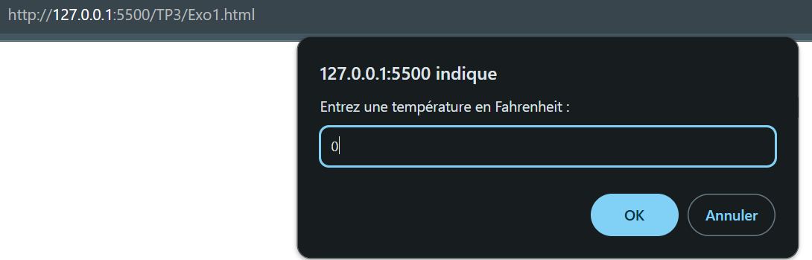
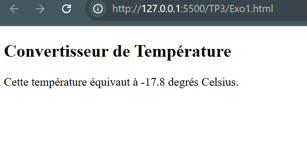

---

### 2️⃣ **Conversion de Durée**

- **Objectif** : Convertir un nombre de secondes donné en jours, heures, minutes et secondes.
- **Entrée utilisateur** : Durée en secondes.
- **Résultat affiché** : Durée équivalente en jours, heures, minutes et secondes.

📸 **Exemple de résultat** :  
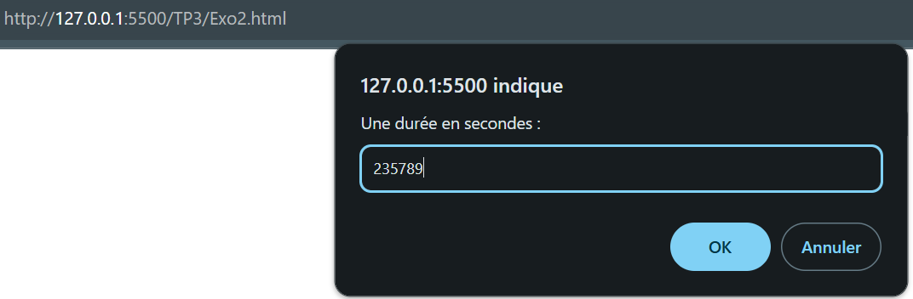
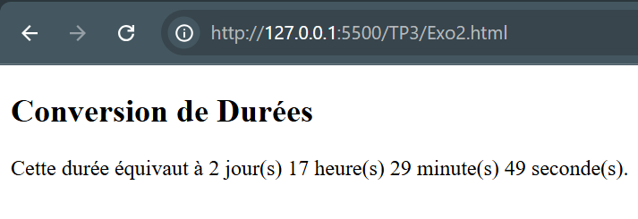

---

### 2️⃣-**bis** **Amélioration de la conversion de durées**

- **Objectif** : Améliorer l'affichage du programme précédent :
  - Supprimer les valeurs nulles (0 jours, 0 heures…).
  - Afficher les unités au singulier lorsqu'elles valent 1.
- **Exemple d'affichage** :
  - **Entrée** : `3621` secondes
  - **Résultat** : `1 heure 21 secondes`

📸 **Exemple de résultat** :  
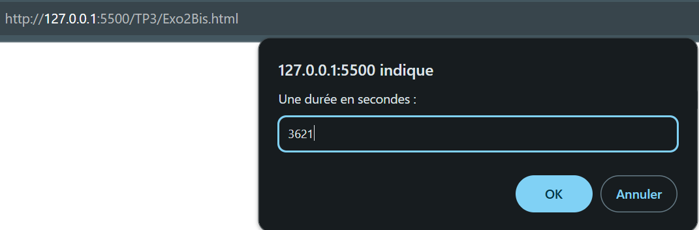
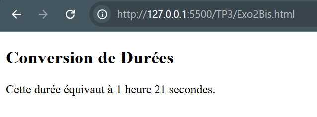

---

### 3️⃣ **Classer 3 nombres**

- **Objectif** : Trier trois nombres donnés par l'utilisateur dans l'ordre croissant.
- **Entrée utilisateur** : Trois nombres.
- **Résultat affiché** : Nombres triés dans l’ordre croissant.

📸 **Exemple de résultat** :  
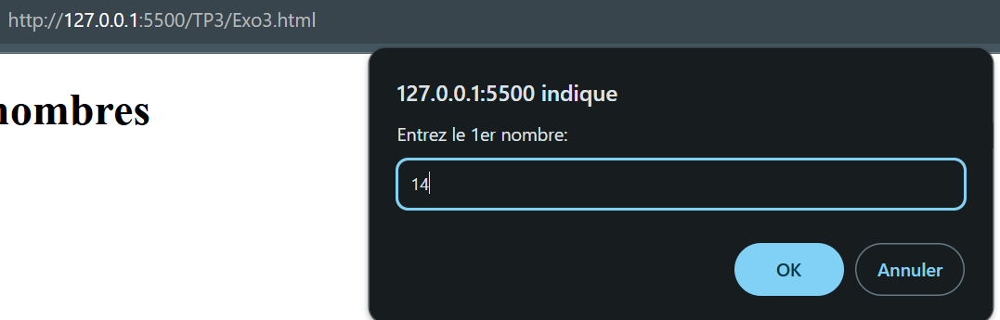
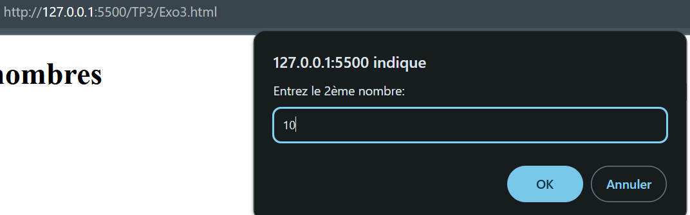
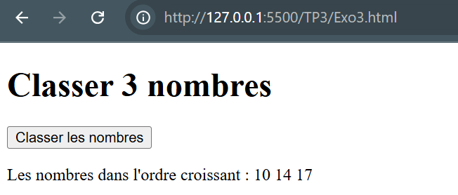

---

### 4️⃣ **Affichage de motifs - Escaliers**

- **Objectif** : Afficher un motif triangulaire de taille donnée par l'utilisateur.
- **Méthode 1** : Utilisation d’une boucle `while`.
- **Méthode 2** : Utilisation d’une boucle `for`.

📸 **Exemple de résultat** :  
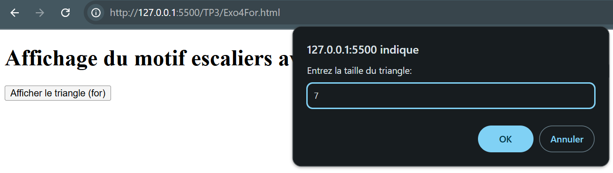
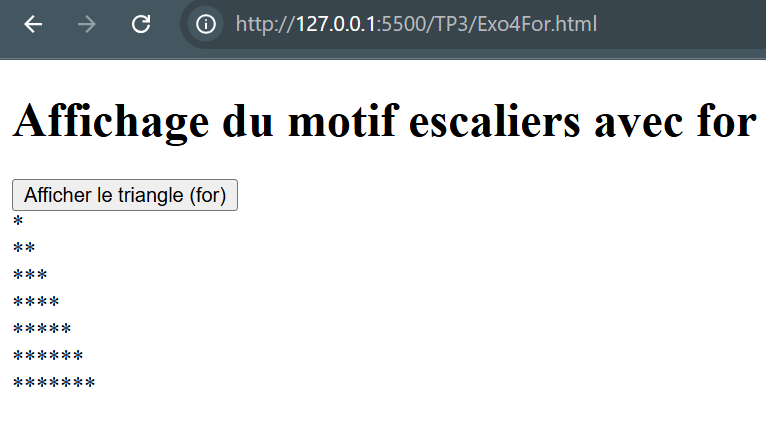

---

### 4️⃣-**bis** **Affichage de motifs - Pyramide**

- **Objectif** : Afficher une pyramide de taille donnée par l'utilisateur.
- **Méthode** : Libre choix entre `while` ou `for`.

📸 **Exemple de résultat** :  
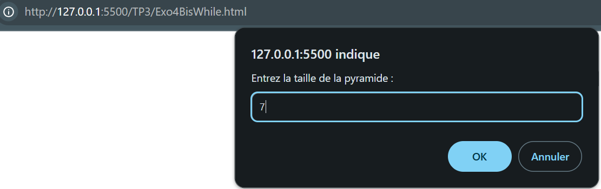
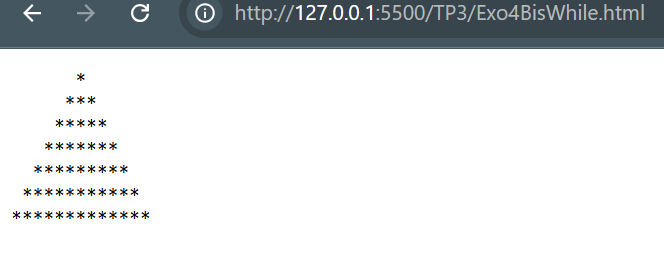

---

### 5️⃣ **Tester si un nombre est premier**

- **Objectif** : Vérifier si un nombre donné par l’utilisateur est premier.
- **Un nombre est premier** s'il n'a que deux diviseurs : 1 et lui-même.
- **Résultat affiché** :
  - Si le nombre est premier : `X est un nombre premier`
  - Sinon : `X n'est pas un nombre premier, il est divisible par Y`

📸 **Exemple de résultat** :  

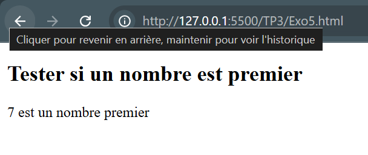
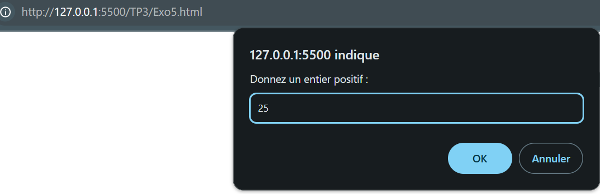
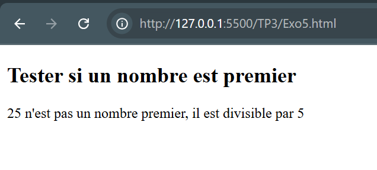

---

### 6️⃣ **Suite de Fibonacci**

#### a) **Calcul du n-ième terme de Fibonacci**

- **Objectif** : Calculer le n-ième terme de la suite de Fibonacci.
- **Entrée utilisateur** : Un entier `n`.
- **Résultat affiché** : La valeur du terme `n`.

#### b) **Recherche du premier terme supérieur à une valeur donnée**

- **Objectif** : Trouver le premier terme de la suite de Fibonacci supérieur à une valeur donnée par l'utilisateur.
- **Entrée utilisateur** : Un nombre limite.
- **Résultat affiché** : La première valeur et son rang.

📸 **Exemple de résultat** :  
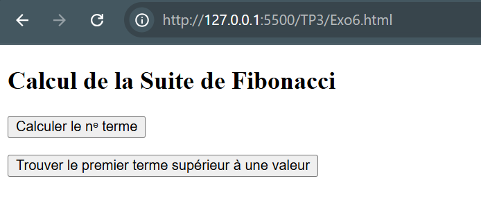
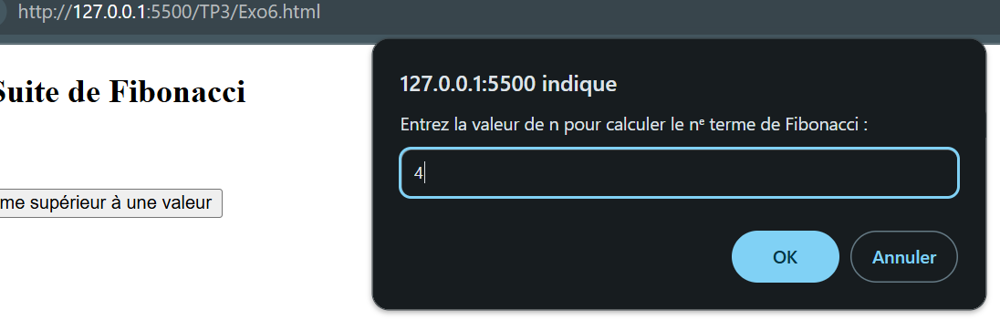
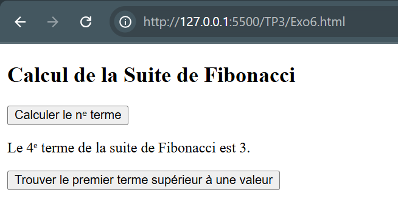
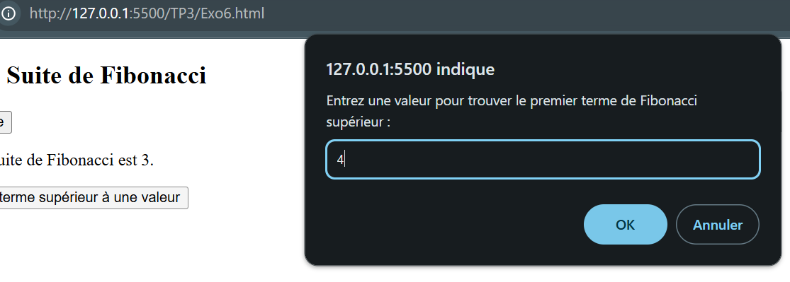
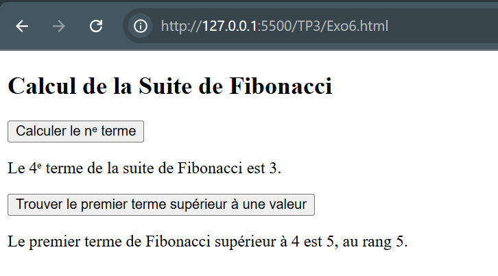

---

### 7️⃣ **Approximation de la racine carrée**

- **Objectif** : Approcher la racine carrée d’un nombre `A` en utilisant la méthode de Newton.
- **Entrée utilisateur** : Un nombre réel `A` entre 1 et 100.
- **Résultat affiché** : Une approximation de `√A` avec une précision de `10⁻⁵`.

📸 **Exemple de résultat** :  
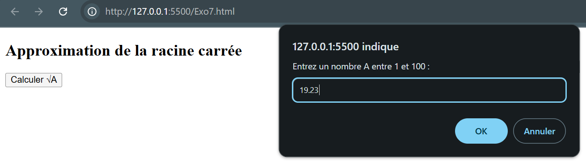
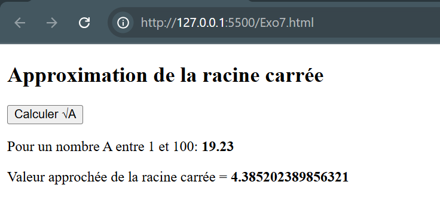

---

## 🚀 **Technologies utilisées**

- **Langage** : JavaScript
- **Affichage** : HTML / Console
