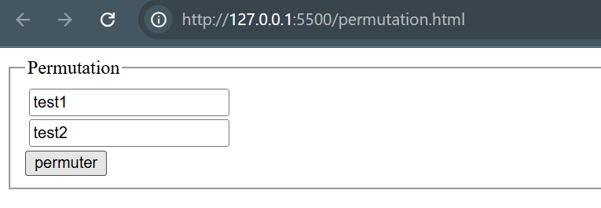
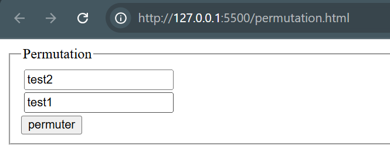
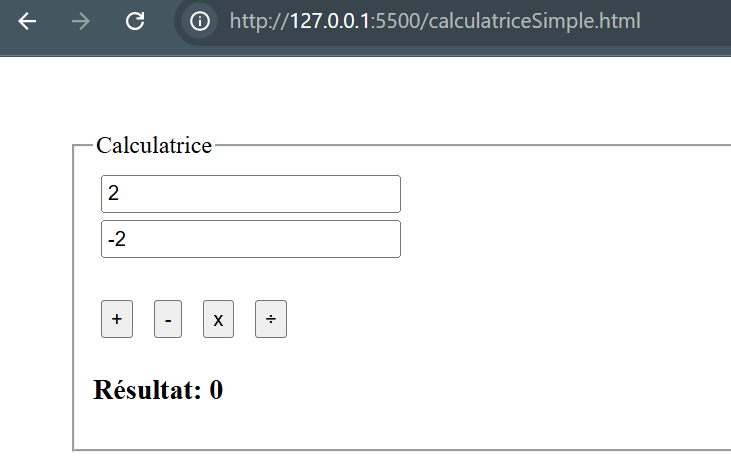
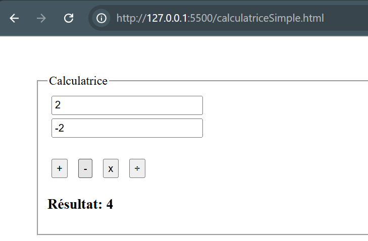
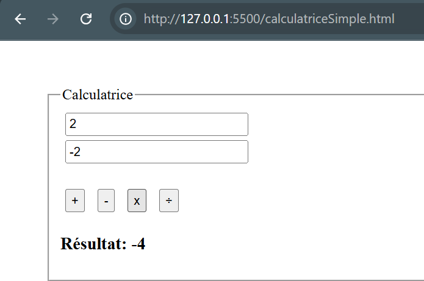
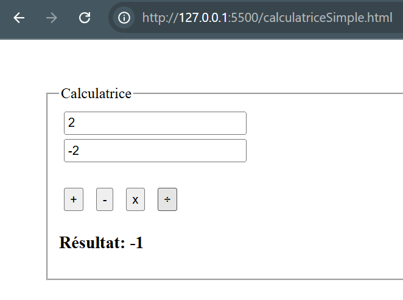
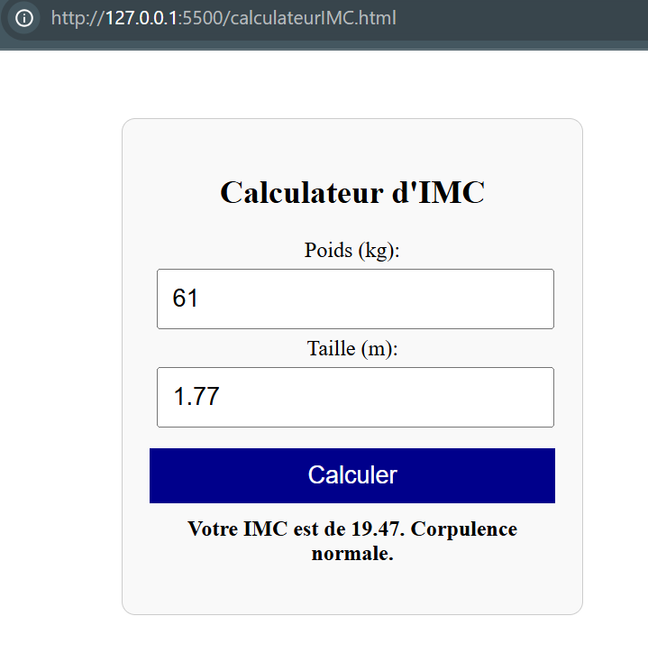
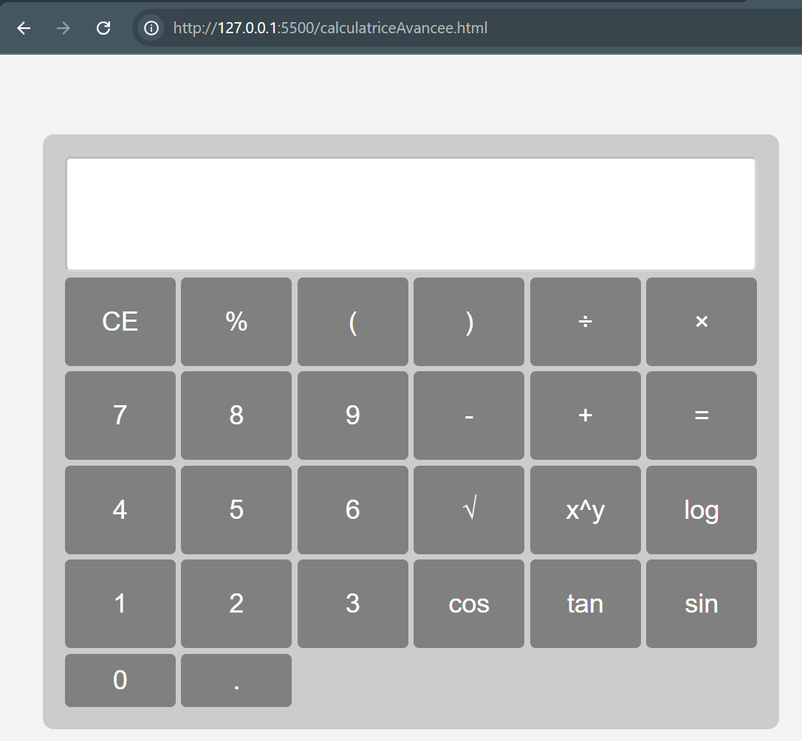

# TP: Exercices en JavaScript

## Description

Ce projet contient plusieurs exercices réalisés en JavaScript, chacun correspondant à une fonctionnalité interactive spécifique.

## Exercices

### Exercice 1 : Permutation

**Objectif :**
Créer un formulaire contenant deux zones de texte et un bouton. En cliquant sur le bouton, le contenu des deux zones de texte est échangé.

**Fichiers :**

- `permutation.html`

**Technologies utilisées :**

- HTML, CSS, JavaScript

**Instructions d'utilisation :**

1. Entrer du texte dans les deux champs.
2. Cliquer sur le bouton "Permuter".
3. Observer l'échange des valeurs.

**Capture d'écran :**

---

### Exercice 2 : Calculatrice Simple

**Objectif :**
Créer une calculatrice permettant d'effectuer les quatre opérations de base : addition, soustraction, multiplication et division.

**Fichiers :**

- `calculatriceSimple.html`

**Technologies utilisées :**

- HTML, CSS, JavaScript

**Instructions d'utilisation :**

1. Entrer deux nombres dans les champs correspondants.
2. Cliquer sur un des boutons pour effectuer l'opération désirée.
3. Le résultat s'affichera sous les boutons.

**Capture d'écran :**

---

### Exercice 3 : Calcul IMC

**Objectif :**
Développer un calculateur permettant de déterminer l'Indice de Masse Corporelle (IMC) d'un utilisateur.

**Fichiers :**

- `calculateurIMC.html`

**Technologies utilisées :**

- HTML, CSS, JavaScript

**Instructions d'utilisation :**

1. Entrer le poids (en kg) et la taille (en mètres).
2. Cliquer sur "Calculer".
3. L'IMC et une interprétation s'affichent.

**Capture d'écran :**

---

### Exercice 4 : Calculatrice Avancée

**Objectif :**
Créer une calculatrice scientifique avec des fonctionnalités avancées telles que sinus, cosinus, logarithme et exponentiation.

**Fichiers :**

- `calculatriceAvancee.html`

**Technologies utilisées :**

- HTML, CSS (Grid), JavaScript

**Instructions d'utilisation :**

1. Saisir une expression mathématique dans la zone d'affichage.
2. Utiliser les boutons pour ajouter des opérations.
3. Cliquer sur "=" pour voir le résultat.

**Capture d'écran :**

---

## Installation et Exécution

Aucune installation requise. Il suffit d'ouvrir les fichiers HTML dans un navigateur web.

## Auteur

IDRISSI Yassine
